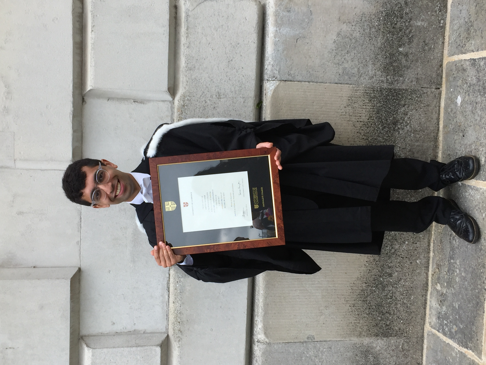
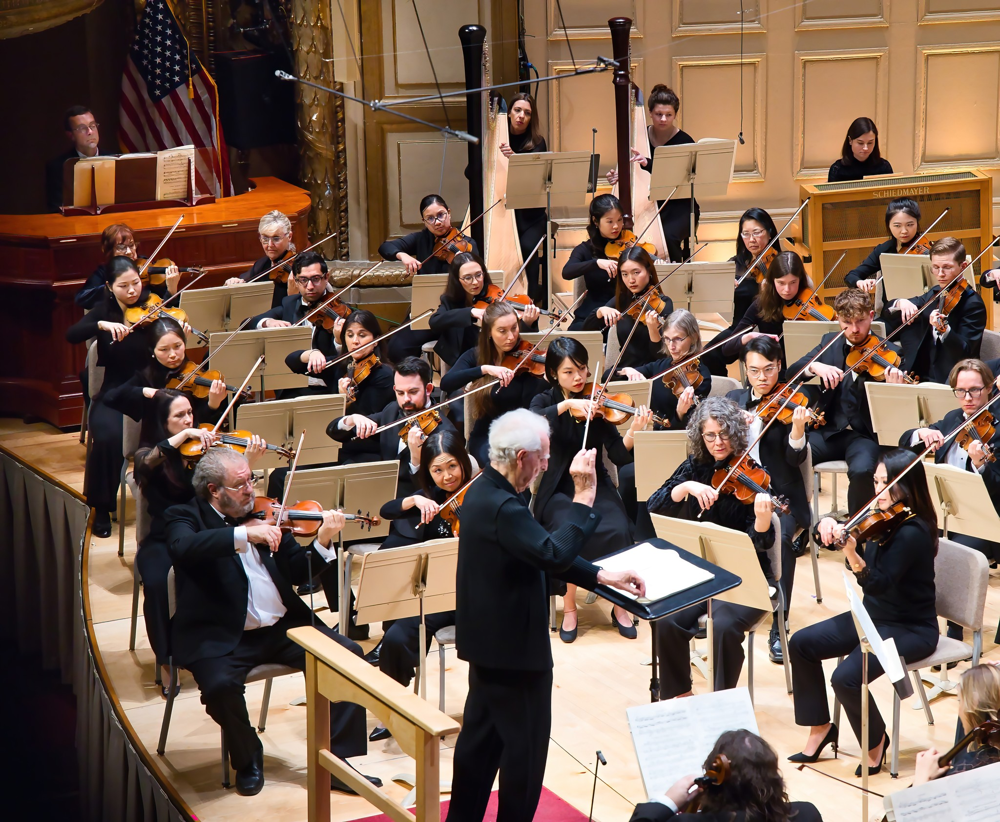

# About me

## Early life

I was born and raised in London, United Kingdom. Growing up, I was drawn to both maths and music, and I dedicated much of my childhood and teenage years to both. As a mathematician, a highlight was leading a team from Westminster School to victory at the United Kingdom Mathematics Trust's [Senior Team Maths Challenge](https://ukmt.org.uk/team-challenges/senior-team-mathematical-challenge) in 2013 and subsequently participating in the Italian Mathematical Olympiad team challenge in Cesenatico, Italy. As a musician, I took lessons in violin, viola, voice, piano, recorder and composition. I was a regular participant at the [Sound and Music Summer School](https://soundandmusic.org/compositionschool/) between 2007 and 2011, received recognition in a wide range of composition competitions including the 2012 [BBC Proms Inspire Competition for Young Composers](https://www.bbc.co.uk/programmes/articles/4mY3MbSJ5G2LvSbzZPbc85G/bbc-young-composer), and was a first violinist in the [National Youth Orchestra of Great Britain](https://www.nyo.org.uk/) in 2013.

## Academic career

### Undergraduate: Magdalene College, University of Cambridge

After a brief stint of studying maths at the University of Cambridge, I switched to studying music for my BA and graduated with Double First Class Honours and a Distinction in my final year. During my time at Cambridge, I maintained an active performance schedule as a violinist, violist and baroque violinist: I performed solo and chamber recitals and as concertmaster of various ensembles including the Cambridge University Chamber Orchestra (now the [Cambridge University Orchestra](https://www.cmp.cam.ac.uk/opportunities/entry/cambridge-university-orchestra/)), and was a winner of the [Cambridge University Symphony Orchestra's](https://www.cuso.org.uk/) concerto competition.

{ width=40% style="display: block; margin: 0 auto;" }

My graduation from the University of Cambridge in June 2017.

### Masters: Stanford University

I also became interested in the intersection between music, maths and the sciences, which led me to an MA in Music, Science and Technology at Stanford University's [Center for Computer Research in Music and Acoustics](https://ccrma.stanford.edu/). I took classes in fields as diverse as audio signal processing, computer-generated sound, algorithmic composition, musical game development, and – most importantly for my academic career – music cognition, music information retrieval, and machine learning. My thesis project, advised by Takako Fujioka and published in the journal [*Music Perception*](https://doi.org/10.1525/mp.2022.39.3.268), used unsupervised machine learning techniques to study how expressive physical motion in violin performance helps to articulate hierarchical musical structure. While at Stanford, I was also a Section Leader in the Computer Science department and remained active as a performer, playing concertos with both the [Stanford Philharmonia and Stanford Summer Symphony Orchestra](https://web.stanford.edu/group/sso/cgi-bin/orchestras/) and participating in the [St. Lawrence String Quartet's Chamber Music Seminar](https://www.slsq.com/).

### Doctorate: Yale University

I moved to Yale University for my PhD, where I was primarily advised by Ian Quinn (Department of Music) and Richard Aslin (Department of Psychology and Yale Child Study Center). In my dissertation, I modelled and measured how listeners form expectations for musical structure as it unfolds in real time. More specifically, I:

- used measures from natural language processing to estimate the likelihood that different chord loops in popular music were likely to feature in a listener's mental model of popular music harmony;
- ran behavioural experiments to explore how listeners' ability to learn an unfamiliar musical style is affected by how widely or narrowly different patterns are distributed across melodies in that style; and
- built computational models of musical surprise to explain the prevalence of certain patterns of thematic repetition in a wide range of musical styles and in novel compositions produced by participants in a set of novel behavioural experiments. 

I am preparing several studies from my dissertation for publication. Besides my dissertation project, I have published a number of other studies which you can find on my [Google Scholar page](https://scholar.google.com/citations?user=KWk1fgUAAAAJ&hl=en&oi=ao). I'm particularly proud of a 2023 publication in the journal [*Cognition*](https://www.sciencedirect.com/science/article/abs/pii/S0010027723002354) which won the award for Best Essay in Music Informatics Scholarship from the [Society for Music Theory's](https://societymusictheory.org/) Music Informatics Interest Group.

Over the course of my PhD, I was a Teaching Fellow and Instructor of Record for six classes, including classes on topics such as natural language processing, the theory of musical rhythm and meter, Western classical and popular music theory, and the history of Western art music. I also had the pleasure of advising a senior thesis project exploring the role of music's predictability on listeners' feelings of happiness. Finally, I continued my commitment to high-level music making as the concertmaster of the [Yale Symphony Orchestra](https://yso.yalecollege.yale.edu/) and as a violinist/baroque violinist in various smaller ensembles. 

## Tech career

While much of my life has revolved around music, I've devoted a significant amount of time to building my technical skills in data science and machine learning, both for the purposes of my graduate study and for personal and professional projects. One of these projects was a [podcast recommender](https://github.com/adityac95/spotify_podcast_rec/) that generated suggestions for new podcasts to listen to based on custom search queries or a provided listening history. This project was ranked first out of twenty-nine projects produced at the [Erdős Institute](https://www.erdosinstitute.org/) in the Fall 2022 session. 

In 2023, while in the middle of my PhD, I worked as a Data Scientist at [Eventellect](https://www.eventellect.com/), a fast-growing company that manages and prices ticket inventory for sports teams and musical artists. I developed forecasting models of ticket price fluctuation for various NFL teams and for the US Open Tennis tournament. In July 2025, I will start working at [Upstart](https://upstart.com/) as a Research Scientist, where I'll be building models to detect fraudulent loan applications among other exciting projects.

I'm committed to teaching and mentoring the next generation of tech professionals at multiple stages of their career. At [Inspirit AI](https://www.inspiritai.com/), I've taught hundreds of high-school students the fundamentals of machine learning and guided them through structured projects, including a [hit-song prediction project](https://github.com/adityac95/music_spotify_project_inspirit) that I developed. At the Erdős Institute, I've provided mentorship for project teams working on problems as diverse as predicting stock prices, modelling hiring trends in the academic job market, classifying different rhythmic patterns in drum beats, generating recommendations for perfumes, and identifying restaurants that are hidden gems or overrated in the city of Philadelphia. (These last two projects were awarded distinction!)

## Other musical highlights

In the depths of the COVID pandemic, playing violin brought me a lot of personal joy and fulfilment. I enjoyed sharing multitracked recordings of a wide range of pieces, including [this fugue](https://www.youtube.com/watch?v=v_1NTRe11VE) that I composed for a seminar at Yale. I was also an honourable mention in the World Bach Competition presented by the [Boulder Bach Festival](https://www.boulderbachfestival.org/about/world-bach-competition/). You can find my performance [here](https://www.youtube.com/watch?v=ODAFjCD3u5o).

{ width=80% style="display: block; margin: 0 auto;" }

Performing in <em>The Planets</em> by Gustav Holst in the Boston Philharmonic Orchestra, November 2024.

Since 2023, I've played in the first violin section of the [Boston Philharmonic Orchestra](https://www.bostonphil.org). We perform regular concerts at Boston Symphony Hall, a glorious space with some of the best acoustics I've ever experienced. One of my favourite concerts was a performance of Mahler's monumental Second Symphony, which you can listen to [here](https://www.youtube.com/watch?v=MG5QyqdhdRw). Be sure to come to one of our future concerts!

Finally, in December 2023, I had the incredible opportunity to travel to Yogyakarta, Indonesia, to work with the orchestra of the [Kraton Ngayogyakarta Hadiningrat](https://www.kratonjogja.id/), the royal palace of Sri Sultan Hamengkubuwono X. I directed the orchestra from the violin in a program of Elgar, Händel and Mozart, and taught violin and chamber music masterclasses at the [Indonesian Institute of the Arts (ISI)](https://www.isi.ac.id/) and the [Sekolah Menengah Musik Yogyakarta](https://smmyk.sch.id/). I hope to return in the future!

