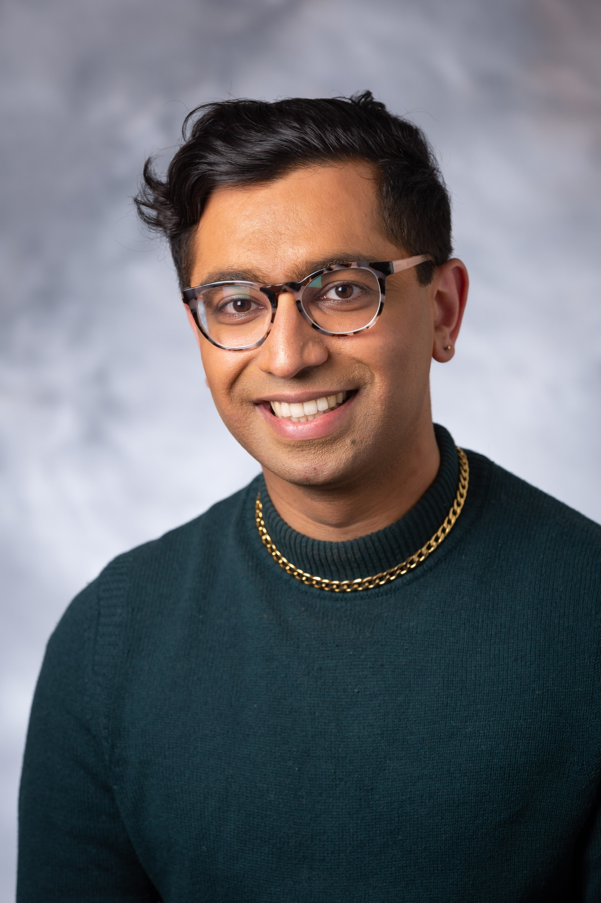

# Welcome!

{ width=200px }

Hi, I'm Aditya Chander! I'm a data scientist, academic researcher and musician living in Boston, Massachusetts. I received a PhD in Music Theory from Yale in May 2025. From July 2025, I will be a Research Scientist at Upstart, where I'll be working on building machine learning models to help more people get approved for loans.

Learn more about me via the navigation bar at the top of this site. Feel free to [contact me by email](mailto:adityachander@gmail.com) if you'd like to connect. You can also take a look at my [Github](https://github.com/adityac95) and [LinkedIn](https://www.linkedin.com/in/aditya-chander-66b960103/) pages.

